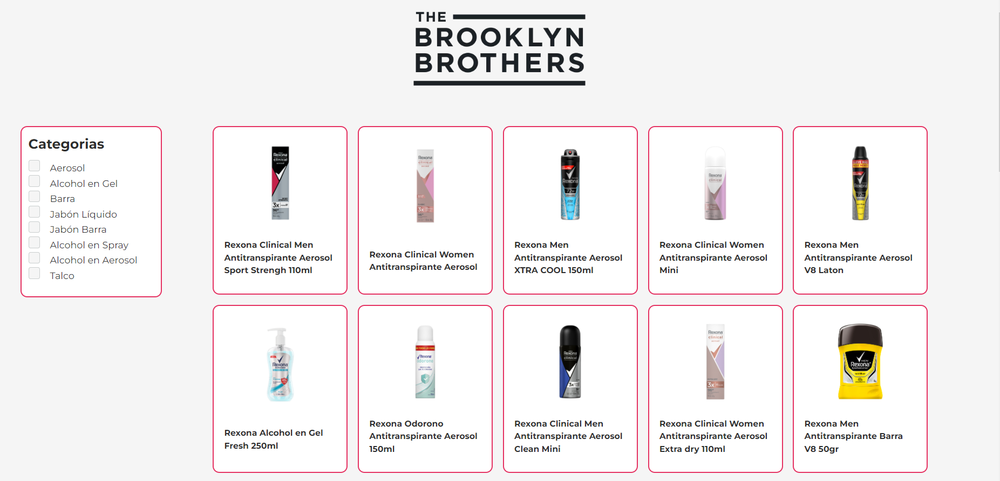
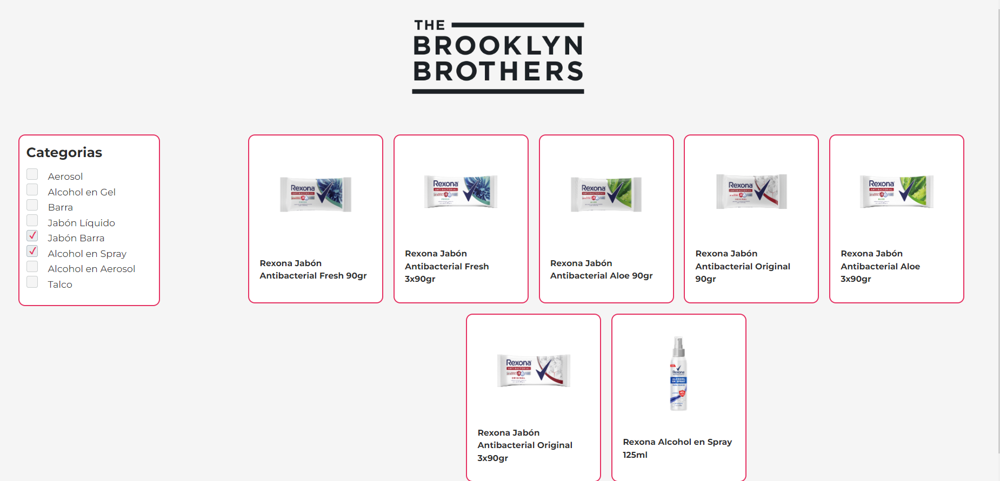
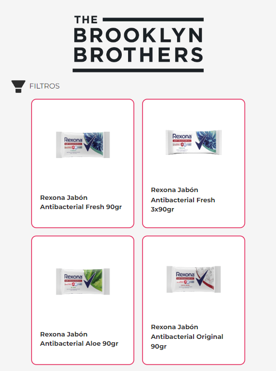
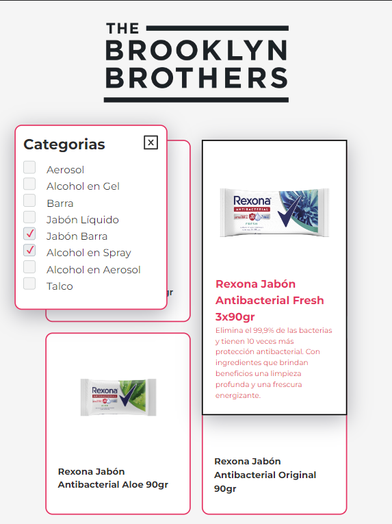
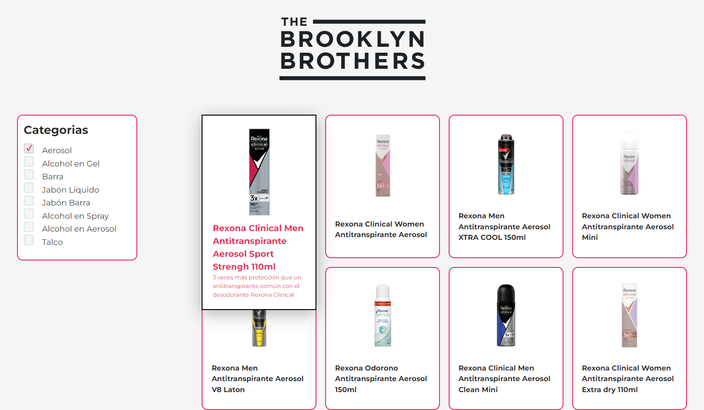

<h1 align="left">
    
</h1>

<h2 align="center"> Lista de produtos feita como parte do Processo Seletivo TBB</h2>

<h3 align="center"> Criada com a stack  React, Node  e SCSS </h3>

<p align="center"> Através de uma linguagem moderna e otimizada, o  Typescript, a aplicação é responsiva, produtiva e performática. </p>

---
Usando um arquivo JSON como banco de dados, a página dispõe uma lista de produtos com imagem e título. Ao sobrepor o produto com o cursor, mais detalhes sobre ele são exibidos. Além disso, é possível filtrar os produtos selecionando uma ou mais categorias.
## Para rodar a aplicação

> OBS: pode-se utilizar o gerenciador de pacotes npm ou o yarn para rodar os comandos abaixo

Execute ```npm install``` na pasta src para instalar as dependências.

Rode ```npm start``` na pasta src para utilizar a versão web. Acesse via **localhost:3000**.
## Telas

<p align="center">
    
    
    
    
    
</p>

<h4 align="center"> <em>&lt;/&gt;</em> by <a href="https://github.com/mariconpe" target="_blank">mariconpe</a> </h4>